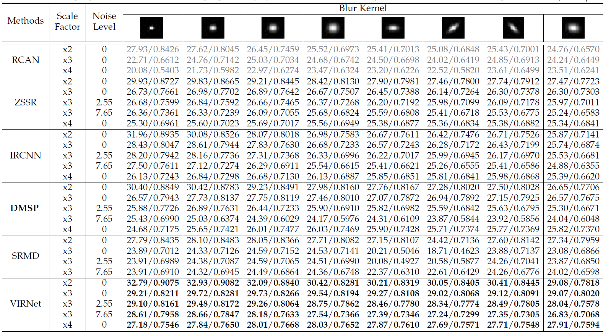

TensorFlow V2 implementation (See [DMSP-tensorflow page](https://github.com/siavashBigdeli/DMSP-tensorflow) for V1 implementation, and [DMSP page](https://github.com/siavashBigdeli/DMSP) for Caffe and MatCovNet implementations).
This repo. includes more general restoration formulation with sub-sampling (used in e.g. super-resolution)
## Deep Mean-Shift Priors for Image Restoration ([project page](https://www.cs.umd.edu/~zwicker/projectpages/DeepMeanShiftPriors-NIPS17.html))

Siavash Arjomand Bigdeli, Meiguang Jin, Paolo Favaro, Matthias Zwicker

Advances in Neural Information Processing Systems (NIPS), 2017

### Abstract:
In this paper we introduce a natural image prior that directly represents a Gaussian-smoothed version of the natural image distribution. We include our prior in a formulation of image restoration as a Bayes estimator that also allows us to solve noise-blind image restoration problems. We show that the gradient of our prior corresponds to the mean-shift vector on the natural image distribution. In addition, we learn the mean-shift vector field using denoising autoencoders, and use it in a gradient descent approach to perform Bayes risk minimization. We demonstrate competitive results for noise-blind deblurring, super-resolution, and demosaicing.

See [manuscript](https://papers.nips.cc/paper/6678-deep-mean-shift-priors-for-image-restoration.pdf) for details of the method.

This code runs in Python and you need to install [TensorFlow](http://www.tensorflow.org).
### Contents:

[demo_DMSP.py](https://github.com/siavashBigdeli/DMSP-TF2/blob/master/demo_DMSP.ipynb): Includes an example jupyter notebook for non-blind and noise-blind image restoration.

[DMSPRestore.py](https://github.com/siavashBigdeli/DMSP-TF2/blob/master/DMSPRestore.py): Implements MAP function for non-blind image restoration. Use Python's help function to learn about the input and output arguments.

[DAE/](https://github.com/siavashBigdeli/DMSP-TF2/tree/master/DAE/): Includes DAE model (tf.saved_model).

[data](https://github.com/siavashBigdeli/DMSP-TF2/tree/master/data): Includes sample image(s).

### Generic restoration results including blur, noise, and downsampling
The benchmark for this is from https://github.com/zsyOAOA/VDNet:
Average PSNR/SSIM results of comparing methods under different combinations of scale factors, blur kernels and noise levels on Set14. The best
results are highlighted in bold. The results highlighted in gray color indicate unfair comparison due to mismatched degraded assumptions.

<!---
#### Set14
| Scale factor | Noise level | Kernel 1       | Kernel 2       | Kernel 3       | Kernel 4       | Kernel 5       | Kernel 6       | Kernel 7       | Kernel 8       |
|:------------:|:-----------:|:--------------:|:--------------:|:--------------:|:--------------:|:--------------:|:--------------:|:--------------:|:--------------:|
| 2            | 0           | 30.40 / 0.8849 | 30.42 / 0.8783 | 29.23 / 0.8491 | 27.98 / 0.8160 | 27.76 / 0.8167 | 27.28 / 0.8020 | 27.50 / 0.8028 | 26.65 / 0.7706 |
| 3            | 0           | 26.57 / 0.7943 | 27.73 / 0.8137 | 27.75 / 0.8119 | 27.46 / 0.8010 | 27.07 / 0.7872 | 26.94 / 0.7892 | 27.15 / 0.7925 | 26.57 / 0.7675 |
| 3            | 2.55        | 25.88 / 0.7726 | 26.89 / 0.7631 | 26.44 / 0.7233 | 25.90 / 0.6910 | 25.82 / 0.6982 | 25.59 / 0.6842 | 25.63 / 0.6795 | 25.30 / 0.6671 |
| 3            | 7.65        | 25.43 / 0.6990 | 25.03 / 0.6374 | 24.39 / 0.6029 | 24.17 / 0.5976 | 24.31 / 0.6109 | 23.87 / 0.5844 | 23.92 / 0.5856 | 24.04 / 0.6048 |
| 4            | 0           | 24.68 / 0.7175 | 25.65 / 0.7421 | 26.01 / 0.7477 | 26.03 / 0.7469 | 25.90 / 0.7428 | 25.71 / 0.7374 | 25.77 / 0.7369 | 25.82 / 0.7370 |

#### Set5
| Scale factor | Noise level | Kernel 1       | Kernel 2       | Kernel 3       | Kernel 4       | Kernel 5       | Kernel 6       | Kernel 7       | Kernel 8       |
|:------------:|:-----------:|:--------------:|:--------------:|:--------------:|:--------------:|:--------------:|:--------------:|:--------------:|:--------------:|
| 2            | 0           | 34.20 / 0.9372 | 34.09 / 0.9342 | 32.62 / 0.9172 | 31.20 / 0.8972 | 30.54 / 0.8884 | 30.10 / 0.8768 | 30.58 / 0.8911 | 29.58 / 0.8674 |
| 3            | 0           | 30.30 / 0.8885 | 31.21 / 0.9018 | 31.10 / 0.8989 | 30.62 / 0.8894 | 30.00 / 0.8773 | 29.79 / 0.8710 | 30.21 / 0.8852 | 29.51 / 0.8663 |
| 3            | 2.55        | 28.44 / 0.8505 | 29.58 / 0.8354 | 28.79 / 0.7895 | 28.04 / 0.7588 | 27.98 / 0.7690 | 27.50 / 0.7429 | 27.72 / 0.7499 | 27.34 / 0.7442 |
| 3            | 7.65        | 28.15 / 0.7733 | 26.93 / 0.6996 | 26.13 / 0.6693 | 25.89 / 0.6718 | 26.02 / 0.6842 | 25.41 / 0.6549 | 25.63 / 0.6648 | 25.80 / 0.6940 |
| 4            | 0           | 27.47 / 0.8307 | 28.49 / 0.8531 | 28.79 / 0.8556 | 28.78 / 0.8532 | 28.67 / 0.8491 | 28.26 / 0.8352 | 28.33 / 0.8461 | 28.50 / 0.8448 |
-->

### License
 This work is licensed under a <a rel="license" href="http://creativecommons.org/licenses/by-nc-sa/4.0/">Creative Commons Attribution-NonCommercial-ShareAlike 4.0 International License</a>.
